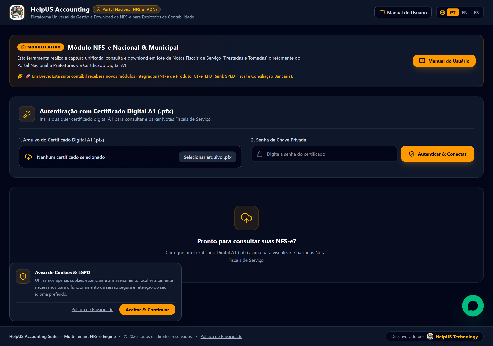
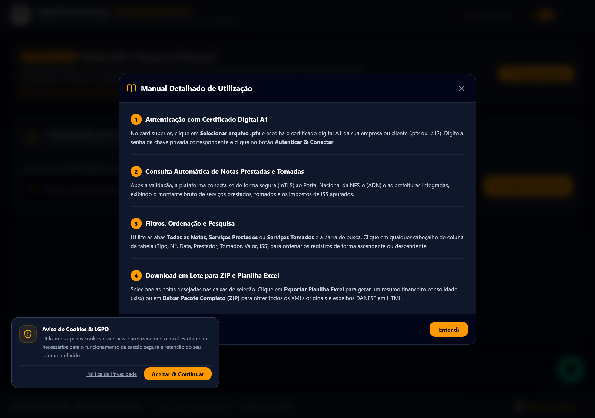
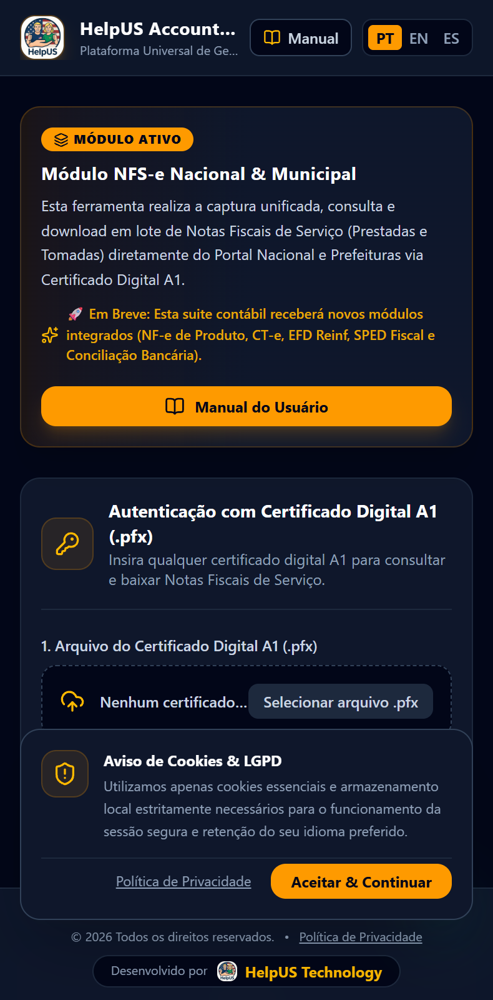

# Guia de Novidades e Atualizações — HelpUS Accounting

Este relatório visual apresenta as novas funcionalidades e melhorias implementadas na plataforma **HelpUS Accounting** no dia **23/09/2026**, orientando os usuários sobre onde e como utilizar cada novo recurso.

---

## 📸 Capturas de Tela do Sistema

### 1. Visão Geral do Portal (Desktop)

*Figura 1: Interface principal em computador exibindo a logo HelpUS no cabeçalho, botão do Manual do Usuário, banner do módulo ativo e os botões de ordenação por coluna na tabela.*

---

### 2. Manual do Usuário e Responsividade Mobile

| Manual Interativo | Visão Mobile Responsiva |
|---|---|
|  |  |

*Figura 2: Janela do Manual do Usuário (esquerda) e visualização adaptada para telas de celular (direita).*

---

## 📌 Resumo Guiado das Novidades para o Usuário

### 1. Ordenação Clicável por Coluna na Tabela
- **Onde ver**: Na linha de título (cabeçalho) da tabela de Notas Fiscais.
- **Como usar**: Clique no nome de qualquer coluna (**TIPO**, **Nº NFS-E**, **DATA EMISSÃO**, **PRESTADOR**, **TOMADOR**, **VALOR SERVIÇO** ou **ISS**) para ordenar os registros imediatamente em ordem crescente ou decrescente. Um ícone de seta indica a coluna selecionada.

### 2. Botão "Manual do Usuário"
- **Onde ver**: No topo superior direito do cabeçalho, ao lado do seletor de idiomas (PT/EN/ES).
- **Como usar**: Clique no botão para abrir uma janela explicativa com o passo a passo para autenticar o certificado digital A1, consultar notas e exportar pacotes ZIP e planilhas Excel.

### 3. Logotipo Oficial HelpUS & Favicon
- **Onde ver**: No canto superior esquerdo do cabeçalho, no ícone da aba do navegador e no rodapé.
- **Benefício**: Identidade visual padronizada garantindo que você está acessando o ambiente seguro oficial da HelpUS Technology.

### 4. Banner Informativo do Módulo e Futuros Recursos
- **Onde ver**: Cartão localizado logo abaixo do cabeçalho principal.
- **Benefício**: Informa detalhes sobre a captura atual de NFS-e e anuncia os novos módulos contábeis que serão adicionados em breve nesta mesma plataforma (NF-e de Produto, CT-e, SPED Fiscal e Conciliação).

### 5. Atendimento via WhatsApp Flutuante
- **Onde ver**: Canto inferior direito da tela (ícone verde animado).
- **Como usar**: Clique no botão para abrir diretamente o chat de suporte no WhatsApp **(83) 99872-1848**.

### 6. Rodapé Fixo e Políticas de Privacidade / LGPD
- **Onde ver**: Barra fixa no final da página.
- **Benefício**: Mantém os links de Privacidade e suporte sempre acessíveis durante a rolagem.
